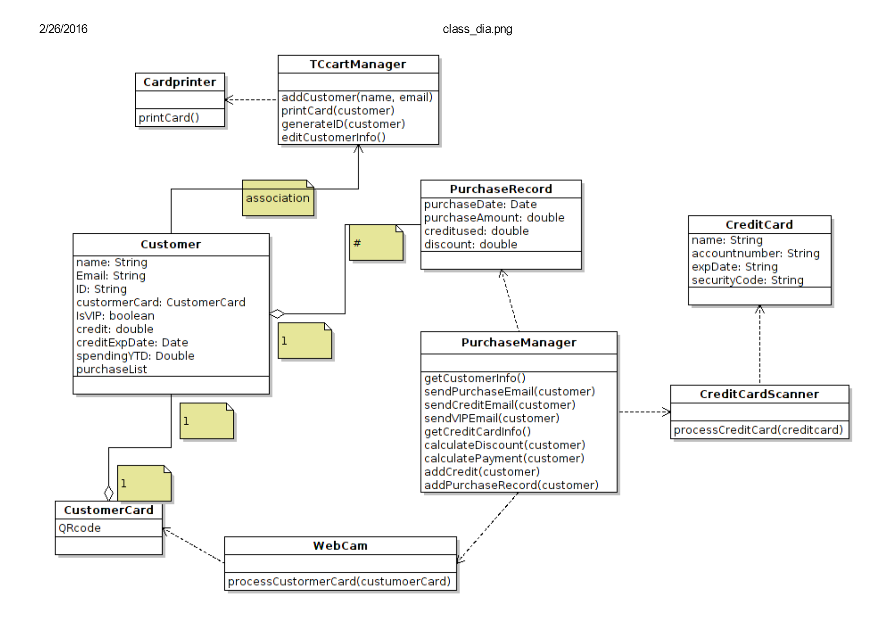

## Individual Design Review
### Design 1 - Bulent

Pros:   
* Detailed mapping already done with all methods and arguments already defined.   
* EmailAddress validation in class.   
* VIPNotificationSent boolean to prevent multiple sends.   
* CustomerCard print is set up better with QRCode as an image.   
* Centralized on CartManager class as the main class.   
* Transactions as an Association class between Customer and Order.   
* CustomerCard class takes UniqueID and generates a QR Code image to send to the card printer.   
* Good flow of functionality, every class is not connected to each other (low coupling).   

Neutral:   
* PurchaseHistory and Transactions saved on Customer.   
* CreditCardScanner and CreditCardProcessor on CartManager.   
* Functionality for discount percentage amount.   

Cons:   
* Random generated UniqueID could be unnecessary.   
* Database class could be shown.   
* Could go further and state whether Attributes are private or public, needs consistency.   
* May have extra functionality not needed in requirements. We would need to discuss with the customer what they want (for example Tea/Coffee classes).   

### Design 2 - Chang

Pros:   
* CreditCardScanner linked to CreditCard makes sense logically.   
* CustomerCard class having QRCode data is good.   
* Clean design and coupling is low.   
* Separation of flow with TCcartManager managing customer functionality and PurchaseManager dealing with Purchase functionality.   

Neutral:   
* Credit expiration date calculated up front with ExpDate vs last earned reward date.   

Cons:   
* PurchaseRecord flow with Customer and PurchaseManager confusing    
* Missing CreditCardProcessing functionality   
* PurchaseRecord binded to PurchaseManager   
* Aggregation error between Customer and TCcartManager   
* No item class   
* No operation to access purchase history   

### Design 3 - Brandon  

Pros:   
* Concise and clear flow with centralized CartManager.   
* CartItem simplified which may be better if extra functionality is not needed.   
* Has a clear separation of responsibilities with Purchase, CartManager, and Customer.   
* Links the Purchase with CreditCard.   
* Has the clearCreditCardInfo() function to explicitly show the credit card information is not stored.   
* Purchase does all the payment processing.   
* CreditCard processing is its own separate cluster.   
* updateAllVIP status to process all the VIPs on January 1st.   

Neutral:   
* Different solution for CreditCard as both a data structure and a credit card manager.   
* Shows DataSource for database.   
* All Customers and Purchases are stored in CartManager (instead of Purchases stored in Customer).   

Cons:   
* Could use various storage methods besides DataSource, detail is unnecessary.   
* Customer attribute in Purchase class has no linkage to Customer.   
* CustomerCard class with QR code data doesnt exist, it is a string in customer instead of an image.   
* processPayment arrow should be reversed.   
* CreditCard portion is confusing, it may be better to call it CreditCardManager.   
* Make CreditCard a Utility class.   

### Design 4 - Zhi 

 

Pros:   
* Good detail of all attributes, attribute types, processes, and arguments.   
* VIPCustomer inheriting Customer class is an interesting idea.   
* Tracking Purchases on CustomerCard is an interesting idea.   
* QRCode explicitly defines encoding and decoding.   
* Can have a rewards card with no purchases (which matches the real world business model).   

Neutral:   
* Centralized on interface.   

Cons:   
* Difficult to read with lines overlapping objects.   
* Coupling may be high.   
* Need a class to implement the interface.   
* It may be better to add functionality in Card to the main class of CartManager.   
* VIPCustomer inheritance is unnecessary and would be difficult to typecast between regular customer and VIP.   

## Team Design

### Main Changes   
* We started with the common idea all the team members had of a centralized CartManager as the main class that invokes all the functionality of the design.   
* We incorporated all the common elements, most of which were based off requirements (CreditCardScanner, Customer, Transaction, etc).   
* Most of us have a similar flow from CartManager to Customer to Purchases so we implemented that structure since the CartManager has multiple Customers which have multiple Transactions.   
* We retooled the credit card section to show the CreditCard datatype class as an association class between CreditCardScanner and CreditCardProcessor. This is because the scanner and processor are invoked by the CartManager, but we wanted to show the isolation of the credit card information by removing the connection from the CartManager. The association class also perfectly describes the relationship between scanner and processor.  
* We retooled the Transaction by removing/combining methods and moving all the email functionality to the Transaction. This improves the cohesion, decreases the coupling, and also matches the requirement functionality since all the emailing is triggered by the creation of a Transaction.   
* The most important assumptions is taken from Design 1 and is that there is a batch processing of the Customers at beginning of the year. The VIP is calculated/set, SpendBalance is reset to 0, VIPDiscountBegins is set to null.   

### Minor Changes   
* Chose Transaction over Purchase as the transaction class name.   
* Added encode and decode methods to CustomerCard.   
* Removed DiscountPercentage as it was unnecessary.   
* Explicitly specified UniqueID length of 8 and email address as a String.   
* Decided on CreditExpirationDate over LastEarnedRewardDate.   

### Assumptions   
* Batch processing as stated above.   
* External libraries listed in requirements will be provided.   
* Tea and coffee only two types of Items sold.   

## Summary   
Our team found that we had many different design aspects even different ways of thinking about the project. During the process we made sure to be humble while questioning ourselves and each other persistently. We went into deep discussion of the implementations and did alot of x-or-y comparisons eliminating/adding/reorganizing parts of the design. It seemed we would hit a point and it would just click for all of us that this is how it should be. We had difficulty criticizing our own and each others' designs and had some long discussions there, but we were respectful and in the end we made sure each member got their input and was in complete agreement with the final design.
