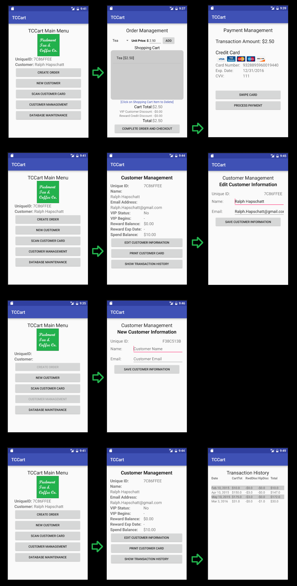

# Design Document

**Author**: Team85

## 1 Design Considerations

### 1.1 Assumptions

- The system will not allow the creation of multiple customers with the same email address. 
- The VideoCam library will provide the necessary API for encoding and decoding QRCodes.  
- The persistance library will run locally and provides enough functionality to execute basic SQL commands. The team has selected SQLLite for this purpose.
- The Email Service will provide the necessary API for sending emails to the customer.     
- The application will run locally on the device, it will only connect to the internet when it needs to process a credit card or send an email.
- The credit card information is not stored anywhere in the system.  
- The application will not have any extra security or backup functionality. 
- There will be only one user so whoever has login access to the device can open and use the application without any limitations.
- Begining of the year (first day of the year), User need to perform Database Maintanance (via button provided in application) to calcualte this years VIP customer and reset Spending Balance to zero. 

### 1.2 Constraints

### 1.3 System Environment

- Android Phone with screen size of 4" or higher
- Bluetooth capability
- Minimum 2GB RAM
- 1GHz CPU or higher speed with minimum 4 CPU cores
- Android API level 19 (kitkat) or newer
- The phone should have a camera for scanning cards   
- Credit Card Reader device that will provide a basic API to read credit card information from a physical credit card.   
- Card Printer that prints a QRCode onto a card. It will be connected to the Android Phone via Bluetooth or WiFi.     
- Credit Card Processor API (External System).
- SQLite Database for local data storage.
- Email Service and API for sending emails.
- Internet Connection.

## 2 Architectural Design

### 2.1 Component Diagram

### 2.2 Deployment Diagram

## 3 Low-Level Design

### 3.1 Class Diagram

## 4 User Interface Design

