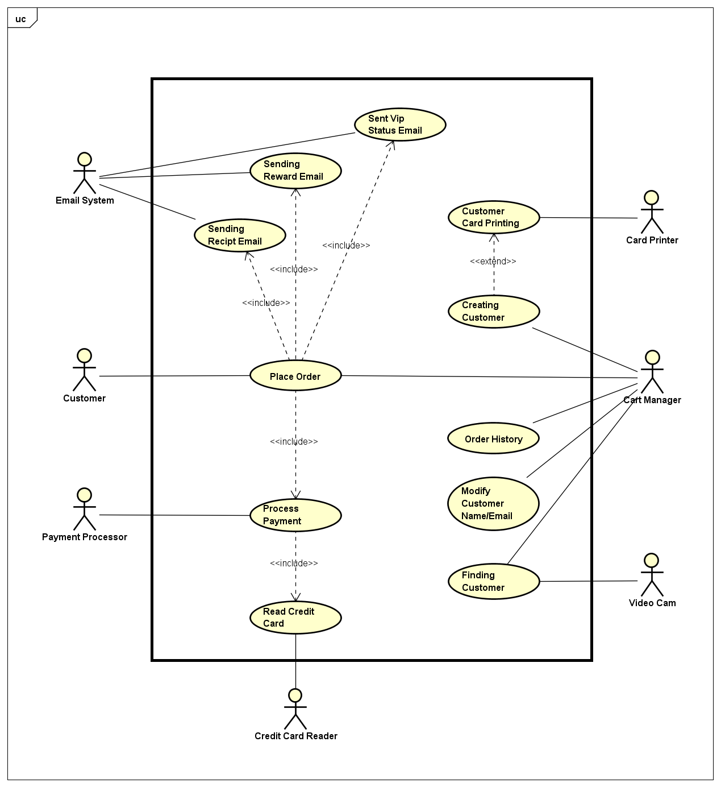

# Use Case Model

**Author**: Team85

## 1 Use Case Diagram

## 2 Use Case Descriptions

#### Use Case 1: Creating Customer
- Requirements: Must allow the Cart Manager to add a customer to the system
- Pre-conditions:
  * Customer needs to make a order
  * Customer is not in the system yet
- Post-conditions:
  * A customer must have been successfully added in the system with his/her information
  * A customer physical card has been printed   
- Scenarios
  + Scenario1:
     * Customer provides name and email and the email doesn't exit in system database
     * Customer successfully added to the system
  + Scenario2:
     * If email already exists, then the system doesn't accept the customer as new customer.

#### Use Case 2: Finding Customer
- Requirements: Must allow the Cart Manager to locate the customer by reading customer card
- Pre-conditions:
 * Customer needs to present the customer card  
- Post-conditions:
  * Cart Manager successfully finds the customer and customer info was displayed
  * Cart Manager can't find the customer
- Scenarios:
  + Scenario1:
     * The Video Cam reads the QR code, the system looks up the customer, found the customer
  + Scenario2:
     * Customer Card is in bad shape, the video cam can't read the card, and the customer is not found

#### Use Case 3: Modify Customer Name/Email
- Requirements: Must allow the Cart Manager to modify customer Name/Email information.
- Pre-conditions:
   * Cart Manager must find the customer in the system
- Post-conditions:
  * The customer info must have been successfully modified and updated in the database   
- Scenarios
  + Scenario1:
     * Cart Manager locates the customer, if the new modified email does not exist in the system, cart manager modifies the customer's email
  + Scenario2:
     * If the modified email already exists in the system, the system doesn't will not allow the customer's email to be changed     

#### Use Case 4: Place Order
- Requirements: Must allow Cart Manager to place order, process payment, send receipt email, reward email, and VIP status email.  
- Pre-conditions:
 * Customer indicates which items out of coffee or tea to purchase
 * Customer already in the system  
- Post-conditions:
 * The order has successfully been processed, payment has been processed, email has been sent to the customer, and all transaction details have been recorded in the database
 * The order is not finished
- Scenarios:
 + Scenario1:
    * Cart Manager adds items selected by the customer into the cart
    * If the customer is a valid VIP, the system applies the VIP discount to the order
    * If previous reward credits exist, the system applies the credits to the order
    * The credit card is successfully swiped
    * The payment is successfully processed 
    * Receipt, VIP Status (if applicable), and Reward Credit (if applicable) information will be emailed to the Customer
    * The transaction successfully finishes and is saved to the database
 + Scenario2:
    * The Cart Manager tries to checkout without any items selected by the customer in the cart
    * The system doesn't allow the Cart Manager to checkout 
 + Scenario3:
    * The credit card is swiped
    * The credit card swipe fails
    * The transaction will not finish
 + Scenario4:
    * The credit card is swiped
    * The system fails to process payment
    * The transaction will not finish  

#### Use Case 5: Order History
- Requirements: Cart Manager must find and display the customer's transaction history.
- Pre-conditions:
   * Customer is located in the system
- Post-conditions:
   * Cart Manager successfully displays the transaction history
- Scenarios:
 + Scenario1:
    * Cart Manager reads the customer's card
    * Customer information is found in the database
    * Cart Manager accesses and displays the transaction history details
 + Scenario2:
    * Cart Manager cannot locate the customer and no transaction history is displayed
